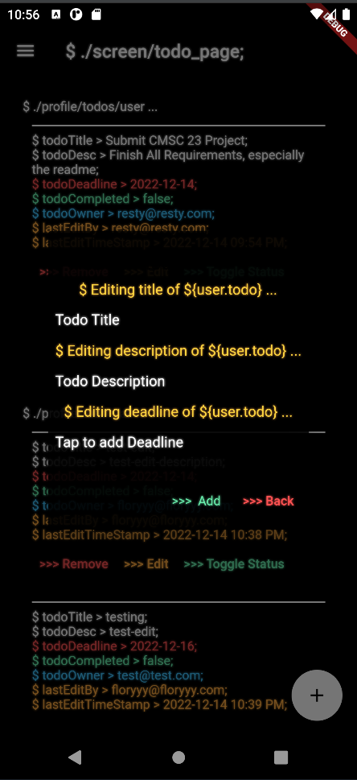

# BashBook Todo List App
*A Flutter & Firebase-powered Shared Task Management Application*

## Author
- **Aron Resty Ramillano**  
- **Student ID:** 2020-xxxxx 
- **Course:** CMSC 23 - D3L  

## Project Overview
BashBook Todo is a Flutter-based mobile application leveraging Firebase to facilitate secure authentication, user profiles, friend management, and shared task lists. Designed with a sleek, terminal-inspired user interface, the app enables users to collaborate effortlessly with friends by viewing and managing each other’s tasks in real-time.

---

## Application Features

### ✔️ **User Authentication**
- **Sign-Up**
  - Users provide:
    - Username (unique)
    - Password (secure validation: min. 8 characters, mix of upper/lowercase, number, special character)
    - Full Name
    - Birthdate
    - Location
  - Input validation for all fields
  - User ID auto-generated by Firebase

- **Login & Logout**
  - Secure login/logout through Firebase Authentication
  - Validation for username and password

### 👤 **User Profile**
- Displays user's ID, Name, Birthdate, Location, and Bio

### 🤝 **Friend Management**
- View friends list and pending friend requests
- Friend profiles include ID, Name, Birthdate, Location, and Bio
- Easily search and add new friends

### 📌 **Shared Todo Lists**
- Friends can view and collaboratively edit tasks
- Features include:
  - **Create Todo:** Only task owner can create tasks
  - **View Tasks:** Friends can view each other's tasks
  - **Edit Tasks:** Editable by both owner and friends; logs last editor's name and timestamp
  - **Delete Tasks:** Deletion restricted to task owner
  - **Status Management:** Task completion status can only be updated by the task owner
- Task Details:
  - Title
  - Description
  - Deadline
  - Completion Status
  - Notifications (planned feature)

---

## Project Timeline & Milestones

| Date             | Milestone    | Minimum Expected Output                                 |
|------------------|--------------|---------------------------------------------------------|
| 21 Nov - 25 Nov  | Milestone 01 | Firebase setup; Fetch/Add data                          |
| 28 Nov - 02 Dec  | Milestone 02 | UI Design and App Navigation                            |
| 05 Dec - 09 Dec  | Milestone 03 | Implement Todo functionality, Friend search/add feature |
| 12 Dec - 14 Dec  | Finalization | Final polishing, debugging, and documentation           |

- **Final Project Deadline:** December 14, 2022
- **Project Presentation:** December 15–21, 2022, during lab hours

---

## Project Grading Criteria

| # | Feature                                | Points       |
|---|----------------------------------------|--------------|
| 1 | Firebase Signup, Login, Logout         | 10 points    |
| 2 | Add, View, Search Friends              | 30 points    |
| 3 | Shared Todo List                       | 25 points    |

---

## Application Screenshots

| Screen                 | Screenshot                 |
|------------------------|----------------------------|
| **Login**              |                      |
| **Signup**             |                    |
| **Home Page**          |               |
| **User Profiles**      |                      |
| **Friends List**       |                  |
| **Friend Requests**    |    |
| **Navigation Drawer**  |                    |
| **Todo List Page**     |               |
| **Edit Todo**          |               |
| **Add Todo**           |                 |

---

## Development Insights & Technical Decisions

- **Terminal-Inspired UI Design:**  
  Inspired by extensive exposure to Linux terminals (especially from CMSC 124 & 125), a terminal-themed UI was adopted, prioritizing simplicity, readability, and a distinct aesthetic.

- **Code Reusability:**  
  Efficiently employed Dart's switch-case constructs within `StreamBuilder` widgets to dynamically render content, minimizing redundancy, and achieving a clean and maintainable codebase.

- **Firebase Integration:**  
  Utilized Firebase's querying capabilities strategically, especially for friend management and filtering users, optimizing performance and simplifying complex logic.

- **Constants Management:**  
  A centralized constants file ensures uniformity in UI elements, significantly easing management and improving consistency across the app.

---

## Challenges Encountered

- **Implementing User Search:**  
  Efficient user search implementation with Firebase proved challenging, exacerbated by tight deadlines and Firebase’s complex querying mechanisms.

- **User Filtering Logic:**  
  Excluding existing friends or pending requests from potential friends’ lists required thoughtful database structure and careful query planning.

- **Firebase Documentation:**  
  Insufficient or ambiguous documentation for specific Flutter-Firebase interactions required extensive research and experimentation.

- **Notifications (Planned but Unimplemented):**  
  Due to time constraints and complexity, notifications weren't fully implemented, identified as a key area for future improvement.

---

## Resources & References

- [Form validation in Flutter](https://www.topcoder.com/thrive/articles/form-validation-in-flutter)
- [Firebase Authentication with Flutter](https://firebase.flutter.dev/docs/auth/usage/)
- [Flutter Navigation Drawer](https://blog.logrocket.com/how-to-add-navigation-drawer-flutter/)
- [Updating Maps in Dart](https://www.kindacode.com/snippet/dart-how-to-update-a-map/)
- [Removing Firebase Array Data](https://stackoverflow.com/questions/59268817/flutter-how-to-remove-a-specific-array-data-in-firebase)
- [Firestore Usage with Flutter](https://firebase.flutter.dev/docs/firestore/usage/)
- [Wrapping StreamBuilder in ListView](https://stackoverflow.com/questions/51400549/how-to-wrap-a-streambuilder-class-with-a-column-or-listview-class-in-flutter)
- [Syncfusion DatePicker](https://pub.dev/packages/syncfusion_flutter_datepicker)
- [Flutter DatePicker Guide](https://mobikul.com/date-picker-in-flutter/)
- [DatePicker on TextField](https://www.fluttercampus.com/guide/39/how-to-show-date-picker-on-textfield-tap-and-get-formatted-date/)
- [Current Date in Flutter](https://devsheet.com/how-to-get-current-date-in-flutter-dart/)
- [Flutter DateFormat](https://api.flutter.dev/flutter/intl/DateFormat-class.html)
- [Flutter Password Field Validation](https://stackoverflow.com/questions/56253787/how-to-handle-textfield-validation-in-password-in-flutter)